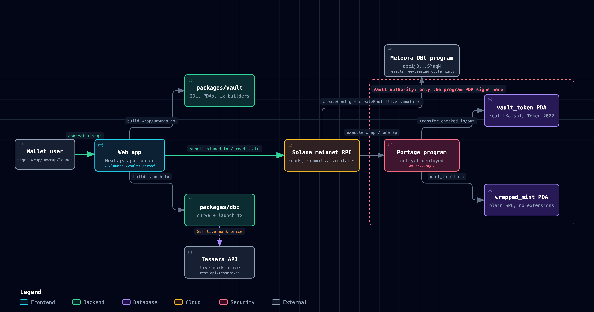

# Architecture

Portage is a Solana Anchor program plus a Next.js app, with two small TypeScript packages sitting
between them. This document describes what each piece does, how a request moves through the
system, and where the trust boundaries sit. See `README.md` for the problem this solves and the
live evidence that it works.

[Interactive version, with guided views for each flow below](docs/architecture/portage-architecture.html)

## Components

**`programs/portage`** (Rust, Anchor 0.32.1). One program, three instructions: `init_vault`,
`wrap`, `unwrap`. Program id `AWHaqsXMZGSj1KamhzmMt11zAzfAZPzeuweT6QYP9Q8V`, not yet deployed to
mainnet (see `README.md`). Three PDAs per underlying mint, all seeded off that mint's pubkey:

- `vault`: an `Account<Vault>` storing the underlying mint, the wrapped mint, and the vault's own
  token account address, so every later instruction can assert accounts by `has_one` instead of
  trusting whatever the caller passes.
- `vault_token`: a Token-2022 token account, owned by the `vault` PDA, holding the real underlying
  token (tKalshi or tOpenAI).
- `wrapped_mint`: a legacy SPL Token mint with zero extensions, mint authority held by the `vault`
  PDA.

**`packages/vault`** (TypeScript). Reads the program's IDL (`src/idl.json`, checked in, generated
by Anchor), derives the three PDAs for a given underlying mint, and builds raw
`TransactionInstruction`s for `init_vault`, `wrap`, and `unwrap` without pulling in the full Anchor
client. `apps/web` imports this package directly; it has no network calls of its own.

**`packages/dbc`** (TypeScript). Wraps `@meteora-ag/dynamic-bonding-curve-sdk`. `portageCurve`
builds the fee schedule and migration config for a launch quoted in a wrapped mint: an exponential
anti-snipe base fee (2,500 bps decaying to 100 bps over 300 seconds across 30 periods), a dynamic
fee, fees collected in the quote token, and migration to a DAMM v2 pool with locked liquidity split
evenly between partner and creator and fees compounding after graduation. `tesseraMarkPrice` reads
Tessera's live mark price so the curve's market caps can be expressed in USD terms.
`buildLaunchTx` calls the SDK's `createConfigAndPool` to produce one transaction.

**`apps/web`** (Next.js). Four pages and four API routes:

- `/`: shows the live DBC rejection (the actual error string and code), the live transfer fee for
  both Tessera tokens, and a wrap/unwrap panel that calls `/api/wrap` or `/api/unwrap`.
- `/launch`: a DBC launch configurator built on `packages/dbc`'s curve, priced against the live
  Tessera mark from `/api/market`.
- `/vaults`: reads each vault's `vault_token` balance and `wrapped_mint` supply directly from RPC
  on every request (`export const dynamic = "force-dynamic"`) and shows whether the invariant
  holds right now.
- `/proof`: calls `/api/simulate` twice, once with `quote=raw` (real tKalshi) and once with
  `quote=plain` (a JitoSOL stand-in, since the real wrapped mint does not exist on mainnet yet),
  and shows both `simulateTransaction` results side by side.
- `/api/market`: live mark price plus live on-chain transfer fee for tKalshi and tOpenAI.
- `/api/wrap`, `/api/unwrap`: build an unsigned transaction from `packages/vault` for the connected
  wallet to sign; the server never holds a key.
- `/api/simulate`: builds the same DBC `createConfig` + `createPool` transaction as `/launch` would
  and runs it through mainnet `simulateTransaction` with a fixed dummy fee payer, for whichever
  quote mint the caller asks for.

## External systems

- **Solana mainnet RPC** (`api.mainnet-beta.solana.com` by default, overridable with
  `SOLANA_RPC_URL`). Every read of vault or mint state, every transaction build, and every
  simulation goes through this one connection helper (`apps/web/lib/rpc.ts`).
- **Tessera API** (`rest-api.tessera.pe`). The only source for tKalshi and tOpenAI's mark price.
  `apps/web/lib/market.ts` fetches it on every request and writes the result to a cache
  (`apps/web/lib/tessera-cache.ts`); if the fetch fails, it falls back to the last cached price, or
  to a bundled seed snapshot if there is no cache yet, and marks the response `stale` with the
  timestamp of that last good read. The on-chain transfer fee is read separately and always live,
  since it does not depend on Tessera's API at all.
- **Meteora Dynamic Bonding Curve program** (`dbcij3LWUppWqq96dh6gJWwBifmcGfLSB5D4DuSMaqN`,
  mainnet). Portage never modifies this program; it only builds transactions that call it. This is
  the program whose quote-mint check is the entire reason Portage exists.

## Wrap sequence

1. A user connects a wallet on `/` and enters an amount.
2. The web app calls `/api/wrap` with the user's pubkey, the token, and the amount.
3. `apps/web/lib/vault-tx.ts` calls `packages/vault`'s `wrapIx` to build the instruction, adds an
   idempotent create-ATA instruction for the wrapped mint, and serializes an unsigned transaction.
4. The wallet signs it; the web app submits it to Solana mainnet RPC.
5. Inside the program's `wrap` instruction: `transfer_checked` moves the requested amount of the
   underlying token from the user's account into `vault_token`, using the Token-2022 program so
   Tessera's transfer fee is deducted automatically. The program reads `vault_token`'s balance
   before and after to find out exactly how much arrived net of that fee, not the amount the user
   asked to send.
6. The program mints that net amount of `wrapped_mint` to the user, signed by the `vault` PDA.
7. The program reloads both accounts and asserts `wrapped_mint.supply <= vault_token.amount`. If a
   future CPI or an unexpected fee change ever violated that, the instruction would fail here
   rather than let the wrapped supply exceed real backing.

## Unwrap sequence

The reverse of wrap: the program burns the requested amount of `wrapped_mint` from the user (no fee
on this leg, since the wrapped mint has no extensions), then `transfer_checked`s the same amount of
the underlying token from `vault_token` back to the user, signed by the `vault` PDA, which is where
Tessera's transfer fee is taken a second time, on the way out. The same invariant assertion runs
again afterward.

## DBC launch sequence

1. `/launch` reads the live Tessera mark price through `/api/market` and lets the user set a name,
   symbol, and starting and graduation market caps.
2. `packages/dbc`'s `portageCurve` turns those into a `buildCurveWithMarketCap` config, expressing
   both market caps in units of the quote token using the live mark price.
3. `buildLaunchTx` calls the DBC SDK's `createConfigAndPool`, with the quote mint set to the
   wrapped mint address (once a vault exists for that underlying and the program is deployed).
4. The resulting transaction is submitted to Solana mainnet RPC, which routes the `createConfig`
   and `initializeVirtualPoolWithSplToken` instructions to the Meteora DBC program.
5. Because the wrapped mint is a legacy SPL mint with no transfer-fee extension, DBC's
   `is_supported_quote_mint` check reads a zero fee and the pool creation succeeds. `/proof` runs
   this exact call twice, once with the wrapped mint's stand-in and once with raw tKalshi, so the
   difference is visible in one place: the raw call fails at
   `dynamic-bonding-curve/src/utils/token.rs:232` with `QuoteMintHasNonZeroTransferFee` (code
   6081), and the wrapped call returns a full success log.

## Trust boundaries

- **User wallet to Portage program.** The user signs every wrap, unwrap, and launch transaction;
  the web app and both TypeScript packages only build unsigned transactions and never hold a key.
- **Portage program PDA authority.** Only the `vault` PDA can mint `wrapped_mint` or move funds out
  of `vault_token`; every instruction checks the accounts it receives against the addresses stored
  in the `Vault` account (`has_one`) or against the PDA seeds themselves (`seeds`/`bump`), which is
  what stops a substituted token account, a forged wrapped mint, or a vault belonging to a
  different underlying from being passed in. This is the boundary the test suite spends the most
  effort on: five of the eight vault tests are specifically adversarial account-substitution or
  authority checks, not happy-path checks.
- **Tessera, outside Portage's control.** Tessera holds the freeze authority and the transfer-fee
  authority on the underlying mint. Portage cannot prevent a freeze or a fee change; it can only
  read whatever state Tessera has set and account for it correctly, which is why `wrap` reads the
  actual amount received instead of assuming a fixed fee.
- **Meteora DBC, outside Portage's control.** Portage only submits transactions that call Meteora's
  unmodified mainnet program. If Meteora changes its quote-mint check, Portage's launch
  configurator would need to change with it; nothing in Portage can affect Meteora's program
  logic.
