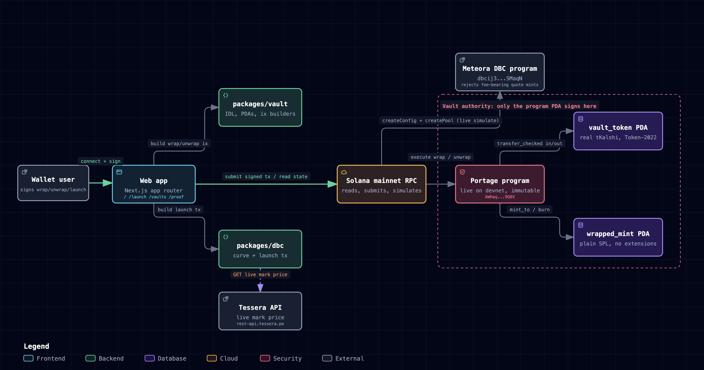

# Portage

**Tessera's fee-bearing pre-IPO tokens, usable as quote collateral on Meteora's Dynamic Bonding Curve.**

Portage wraps tKalshi and tOpenAI 1:1 into a plain SPL mint held by an on-chain vault. Meteora's DBC
program refuses a quote mint with a transfer fee, and the wrapped mint has none. The program is live
on Solana devnet and immutable, the full wrap, launch, buy and unwrap loop has run on chain, and
mainnet simulation shows DBC rejecting real tKalshi with error 6081 while the fee-free quote passes.

## Live links

- Site: https://portage-sol.vercel.app
- `/devnet`, wrap and unwrap against the deployed program from your own wallet: https://portage-sol.vercel.app/devnet
- `/proof`, the same `createConfig` call simulated on mainnet with raw tKalshi (red) and with a fee-free quote mint (green): https://portage-sol.vercel.app/proof
- `/launch`, DBC launch configurator with mainnet simulation: https://portage-sol.vercel.app/launch
- `/vaults`, vault state read straight from RPC: https://portage-sol.vercel.app/vaults
- `/market`, Tessera mark price against the live DEX price: https://portage-sol.vercel.app/market
- `/pitch`, the deck: https://portage-sol.vercel.app/pitch
- `/docs`, program, SDK and guide reference: https://portage-sol.vercel.app/docs (source in [docs/README.md](docs/README.md))

## The problem

Meteora's Dynamic Bonding Curve program checks every quote mint for a Token-2022 transfer fee
before it does anything else. In `dynamic-bonding-curve/src/utils/token.rs`, `is_supported_quote_mint`
throws `QuoteMintHasNonZeroTransferFee` (error code 6081) the moment it finds a non-zero fee, and
it runs that check before the token-badge exemption, so a badge cannot rescue a fee-bearing mint.
The same check runs again on swap, on fee claim, and on migration.

Tessera's tKalshi (`TKLSidmLVt3cqGaaodG8tyRzoANfQwoh67AccjmubeZ`) is a Token-2022 mint with a live
transfer fee. Read straight from mainnet:

```json
{"decimals":9,"transferFeeConfig":{"transferFeeBasisPoints":20},"freezeAuthority":"7n2PNcDXVDMK2m8dyV9cVPNY7p4jM4ZMHv7TzfibEt8o"}
```

That fee alone fails the DBC check, badge or no badge. Portage's own `/api/market` reports the same
number from the live epoch fee schedule: tKalshi and tOpenAI both carry 20 bps (`transferFeeBasisPoints: 20`
on both mints, read fresh on every request).

So every memecoin quoted in tKalshi lives on Raydium, never on Meteora DBC. DexScreener pair data
pulled on 2026-09-24 for four tKalshi-quoted pairs, all on Raydium: WASH/tKalshi at $4,234 liquidity with
zero buys and zero sells in six hours, YES/tKalshi at $40,268 liquidity on 3 buys and 7 sells in a
day, BET/tKalshi at $27,184 liquidity and down almost 16% in 24h, and DOGINU/tKalshi at $30,776
liquidity, the most active of the four but still thin enough for one large exit to clear the book.
Those pools have no bonding curve and no graduation path.

## What Portage does

An Anchor program (`programs/portage`) holds three PDAs per underlying mint: `vault`, `vault_token`
(a Token-2022 account that holds the real tKalshi or tOpenAI), and `wrapped_mint` (a plain SPL
mint with zero extensions). `wrap` moves the underlying token into `vault_token` with
`transfer_checked`, reads back exactly how much arrived net of Tessera's own fee, and mints that
same amount of the wrapped token to the user. `unwrap` burns the wrapped token and transfers the
underlying back out. Every call ends by asserting `wrapped_mint.supply <= vault_token.amount`, so
the wrapped supply can never exceed what the vault actually holds.

Because the wrapped mint is a legacy SPL token with no extensions, its transfer fee reads as zero,
which is all Meteora's DBC program checks for. `packages/dbc` builds the `createConfig` and
`createPool` transaction quoted in that wrapped mint, priced off Tessera's live mark price, with an
exponential anti-snipe fee schedule (2,500 bps decaying to 100 bps over 300 seconds), a dynamic
fee, and migration to a DAMM v2 pool with all LP permanently locked and fees compounding in the
quote token after graduation.

The web app (`web/`) is the ledger for all of this:

- `/` shows the live rejection next to a wrap and unwrap panel.
- `/devnet` is the live crossing: your wallet signs, the app relays to devnet, and every figure is read from the devnet RPC when the page loads.
- `/launch` configures a DBC pool against the live curve code and runs that configuration through a real mainnet `simulateTransaction`. `/api/launch-sim` builds the same `createConfig` plus `initializeVirtualPoolWithSplToken` transaction a real launch would submit, anchored to the live Tessera mark price for tKalshi, and returns the real program logs, the compute units consumed, the starting price implied by the requested market cap, the graduation market cap it simulated and the resulting `migrationQuoteThreshold`. The configurator's graduation input drives that simulation: `graduateMcapUsd` goes to `buildLaunchTx`, and a graduation target at or below the start is rejected with 400.
- `/vaults` reads vault and mint state straight from RPC.
- `/market` answers whether the wrapped token is worth launching against right now. For each of tKalshi and tOpenAI it reads the Tessera mark price (the live number `/api/market` serves), the Jupiter price v3 quote for the same mint, and the largest-liquidity pool from DexScreener. `premiumPct` is `(dexPrice / markPrice - 1) * 100`: positive means the DEX pays more than the Tessera desk, a gap a wrap-and-launch can close. Each panel links its pool to Solscan and offers "Wrap for a DBC launch" and "Launch on DBC".
- `/proof` runs the same `createConfig` call live against raw tKalshi and against a fee-free quote mint, side by side.

## Why it works

- **The fee is on the token being wrapped, not on the token DBC reads.** Token-2022 extensions live per mint, so one program-owned account can custody a fee-bearing token and issue a clean legacy mint against it.
- **1:1 means 1:1 of what arrived.** `wrap` measures the vault's balance before and after `transfer_checked` and mints the difference, so Tessera's 20 bps is accounted for to the base unit, and a fee change cannot break the backing.
- **The DBC checks that matter are all satisfied.** DBC re-reads the quote mint on swap, fee claim and migration. A legacy SPL mint with no extensions passes at every one of them, which a badge or a one-off zero-fee window never could.
- **Slippage minimums are measured, not computed.** `min_minted` and `min_out` compare against the actual balance delta, so a fee change between build and landing cannot silently cost the user more.

## Evidence

| Check | Result |
|---|---|
| Program on devnet | `AWHaqsXMZGSj1KamhzmMt11zAzfAZPzeuweT6QYP9Q8V`, deployed at slot 503782830, programdata `8YhNcVevdXmZmc9D44Ym6zmWxhc2qiaBRPe3fhPP5ia`, upgrade authority none. `solana program show -u devnet` reads `Authority: none`, 332,888 bytes |
| Deployed bytes match the source | `solana program dump -u devnet` and `target/deploy/portage.so` both hash to SHA-256 `de7286a8d068ceba8fd18d314e337ec23588e551c950c0490a9dc86e8bc63e02` (re-read 2026-10-01) |
| Full loop on chain | DBC rejects the raw fee-bearing mint with 6080, wrap 100 returns 99.8, a DBC pool is created on the wrapped mint, a buy fills, unwrap 10 returns 9.98, and the vault holds 89.8 against a wrapped supply of 89.8. Every transaction is linked below and in [DEVNET.md](DEVNET.md) |
| `packages/vault` test suite | 10/10 passing (re-run 2026-10-01), `litesvm` against a fixture of the real mainnet tKalshi mint account |
| Wrap/unwrap round trip | Sending 1,234,567,891 base units mints 1,232,098,755 wrapped tokens (20 bps fee taken by Tessera), unwrapping all of it back returns 1,229,634,557, a total round-trip cost of 4,933,334 base units, about 40 bps, matching the 20 bps charged on each leg |
| Invariant under load | 30 wrap/unwrap cycles with pseudo-random odd amounts across three users, `wrapped_mint.supply <= vault_token.amount` checked and held after every single instruction |
| Live raw-quote simulation | `curl https://portage-sol.vercel.app/api/simulate?quote=raw` returns `"err":{"InstructionError":[0,{"Custom":6081}]}` with the real program log: `AnchorError thrown in programs/dynamic-bonding-curve/src/utils/token.rs:232... QuoteMintHasNonZeroTransferFee` |
| Live fee-free-quote simulation | `curl https://portage-sol.vercel.app/api/simulate?quote=plain` returns `"err":null` with a full `createConfig` + `initializeVirtualPoolWithSplToken` log, 162,050 compute units on the 2026-10-01 read |
| Live transfer fee | `curl https://portage-sol.vercel.app/api/market` returns `transferFeeBps: 20` for both tKalshi and tOpenAI, read from each mint's current epoch fee schedule, not cached |
| Live launch simulation | `node web/check-launch.mjs` (2026-09-25) called `/api/launch-sim?name=Test&symbol=TST&supply=1000000000&startMcapUsd=50000`, got `err: null` back from mainnet `simulateTransaction`, more than 3 real program log lines, a starting price anchored to the live tKalshi mark (413.8 at that run), and an implied start market cap within 5% of the requested $50,000 |
| Graduation target drives the simulation | `node web/check-launch-inputs.mjs` called `/api/launch-sim` with a $50,000 start: a $100,000 graduation target returned `err: null` and `migrationQuoteThreshold` 100099942574, a $1,000,000 target returned `err: null` and 441623967210, and a $40,000 target below the start returned 400 |
| Live mark vs DEX premium | `node web/check-market.mjs` (2026-09-25) read `/api/tmarket` and found tKalshi trading at a 7.82% premium to the Tessera mark and tOpenAI at a 28.02% premium, both computed as `(dexPrice / markPrice - 1) * 100` from the live Jupiter price v3 quote against the same live Tessera mark `/api/market` serves |

### The devnet loop, transaction by transaction

Replica mint [`EsnR4vxz...`](https://explorer.solana.com/address/EsnR4vxz8W2hR9BCQWjaVHMeWSCTB3Qazjc45WzKM9g2?cluster=devnet) (Token-2022, 9 decimals, 20 bps transfer fee, metadata pointer, the same shape as tKalshi).

| Step | Slot | Transaction | Result |
|---|---|---|---|
| Deploy program | 503782830 | [`2jbxWRNX...`](https://explorer.solana.com/tx/2jbxWRNXxA5JLstSp7goeRwvq3NxX5SGJzgDhA53DqFKn8ipTSmYbQzCfDtdqQD6TobU8YbwXy8i1DgT1saRfy88?cluster=devnet) | 332,888 bytes |
| DBC pool quoted in the raw replica | 503805273 | [`5ayYNhV7...`](https://explorer.solana.com/tx/5ayYNhV7MSi5vqP5tcyLunnhYZoP1irMRNVq4Lf1nCGnMcA1wH1yAWpc4KtXTPnmLbe6hiAsZokJNpYv3PSzoiQk?cluster=devnet) | DBC rejects it on chain, `Custom 6080 InvalidTokenBadge` |
| `init_vault` | 503805338 | [`4Loijq4H...`](https://explorer.solana.com/tx/4Loijq4HadAcmLYiQ33hmDkTioQnuNEExxMkfncwGXX2mQdvh86dGtuPaeFR9rrPpWnzSuRYzuaNgzZo5tKXKLWQ?cluster=devnet) | vault, `vault_token`, wrapped mint created |
| `wrap` 100 | 503805367 | [`55NGuYcs...`](https://explorer.solana.com/tx/55NGuYcs2iyNdMUKVLcEKYdb446CdYgQBS7ifVZmAfytUk2boo934nZQFGb9iMwLUyGWpv9q1WnccawSxtPjCD5K?cluster=devnet) | 99.8 wrapped minted, vault 99.8 |
| DBC pool quoted in the wrapped mint | 503813433 | [`3Ekh79t4...`](https://explorer.solana.com/tx/3Ekh79t4kNMWrQNst2cYiyhGTGcqXQdb9n6w45Cw5ugjXK6ovZMPMbo2hWLKvSoGkS4xSL4xF5Jt1pQrLj7zwLRt?cluster=devnet) | pool [`8GN2C1Ry...`](https://explorer.solana.com/address/8GN2C1Ryn5hjLzAs9ncpYbNyXd63rynhv4E1KZRHpQ1Q?cluster=devnet) created |
| Buy, 1 wrapped in | 503813501 | [`4aw5qtUv...`](https://explorer.solana.com/tx/4aw5qtUvAUvy1xCkHnN9C1rwdF47chafnZRURPjFAfNwKe1TnjCa1tY6TVcEzM9xbFfEhXkCXbFtAffdtQceriAZ?cluster=devnet) | 31,186,470.580672 PTGD out |
| `unwrap` 10 | 503813564 | [`5eFhd7F9...`](https://explorer.solana.com/tx/5eFhd7F9mqQTqnhAT1Nt7AdwAmoEtGbcnZeX7ScusMNg4MsKWdKw1fJkLasP4J4jDK9qURUQD8S9hwEmxQCv2bfH?cluster=devnet) | 9.98 received, vault 89.8 |
| Upgrade authority set to final | 503813651 | [`3xxKiV2G...`](https://explorer.solana.com/tx/3xxKiV2Gs5UXxb9nztEXRMDGkQSXWC3fsUx79HiEbzY479piYAdVotn65RZKQD6wGCAZqwpkiD24nFy8t9TcopKz?cluster=devnet) | `Authority: none` |

## How it works

See [ARCHITECTURE.md](ARCHITECTURE.md) for components, data flow, and the wrap/unwrap and DBC launch sequences.



[Interactive version](docs/architecture/portage-architecture.html)

## Security model

- **No admin, no upgrade path.** The program has no admin key, no pause, no fee and no withdraw instruction, and the devnet program's programdata authority is null, so the binary at that address cannot change. The deployed bytes hash the same as `target/deploy/portage.so`. See [docs/program/addresses.md](docs/program/addresses.md).
- **Wrap and unwrap are permissionless.** Anyone can deposit into the vault or redeem their own wrapped tokens; only the vault PDA can mint or move funds inside the vault's own accounts, and every account passed to an instruction is checked against the vault's stored addresses (`has_one` constraints), which is what stops a substituted vault token account or a forged wrapped mint from passing.
- **The supply invariant is enforced on chain.** Every instruction ends by requiring `wrapped_mint.supply <= vault_token.amount`.
- **`init_vault` whitelists extensions.** It only accepts an underlying mint with `TransferFeeConfig`, `MetadataPointer`, or `TokenMetadata`. A mint with a `PermanentDelegate` extension, which would let a third party move vault funds directly, is rejected, and a test constructs exactly that mint and confirms the rejection.
- **Fee changes cannot break the backing.** Portage reads the amount that actually arrived rather than assuming a fixed fee, so Tessera changing its transfer fee changes what a user gets back, never the 1:1 backing.
- **Tessera outages are absorbed.** If `rest-api.tessera.pe` is unreachable the mark price falls back to the last cached read, labelled "(stale)" with its timestamp everywhere it appears. `fetchMarketSnapshot` in `web/lib/market.ts` is the single place this fallback lives. The DEX side of `/market` (Jupiter price v3, DexScreener) shows the real upstream error inline rather than a guessed price.

The trust model, in full, is in [docs/security/trust-model.md](docs/security/trust-model.md).

## Run it

Requires Node with pnpm, Rust 1.84+, and Anchor 0.32.1 (see `Anchor.toml` and
`programs/portage/Cargo.toml`).

```bash
pnpm install
anchor build                                   # produces target/deploy/portage.so, used by the vault tests
(cd packages/vault && npx vitest run)          # 10 tests against the real tKalshi mint fixture
(cd packages/dbc && pnpm sim green)            # dry-run a DBC launch quoted in a fee-free quote mint
(cd packages/dbc && pnpm sim red)              # same call quoted in raw tKalshi, watch DBC reject it with 6081
(cd web && pnpm dev)                           # web app on localhost:3000
```

`web` talks to `api.mainnet-beta.solana.com` by default; set `SOLANA_RPC_URL` to use your own RPC.
To replay the devnet loop, see [docs/guides/reproduce-the-devnet-run.md](docs/guides/reproduce-the-devnet-run.md).

## Built on, and tracks

- **Tessera.** Portage makes tKalshi and tOpenAI usable as bonding-curve collateral, the token-utility case the Tessera bounty asks for, and configures launches so fees compound in the quote token inside the wrapped token's DAMM v2 pool after graduation rather than only rendering a price dashboard.
- **Meteora DBC.** The quote-mint design is not a parameter tweak on an existing config: it makes a Token-2022 mint with a live transfer fee usable as DBC collateral, a class the DBC program's own quote-mint check otherwise rules out unconditionally.
- **Solana.** Token-2022 extensions, program-derived accounts, `transfer_checked` and measured balance deltas are the whole mechanism.

Documentation: [docs/README.md](docs/README.md)
